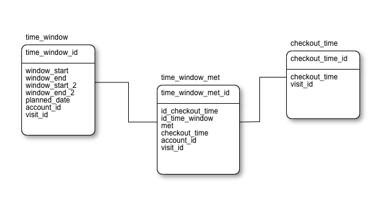
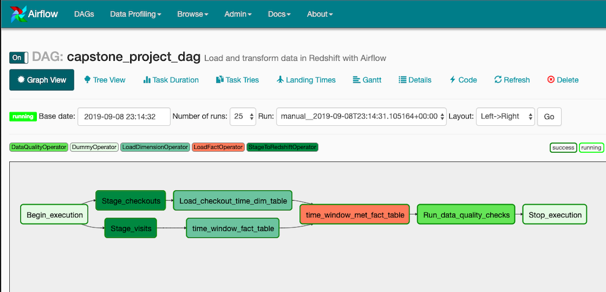

# Data Engineering Capstone Project

## Introduction

A startup focused on deliveries, last mile and fleet tracking, has increased constantly his data during the last 3 years (near to 1.5M of row monthly).

Due to this  exponential data growth, the company understands that this information it's really important and they can perform a data analysis to calrify the quality of the deliveries to the end customer, to do this they want to perform an experiment which answer the next question.

* Deliveries are beign made within the expected time windows?

To answer this questions, they provide to the data engineer two main datasets, which are stored in AWS S3 in two different formats (json, csv)

As a data engineer, the task consist in build an ETL pipeline which perform data extraction from S3, organizing the data into AWS Redshift and transform the data into dimensional and fact tables that can answer the questions directly,  to do this the data should be loaded from S3 into staging tables on redshift and execute SQL statements who create the star schema from the staging tables.

The data engineer then, should be able to perform some kind of of the data automation and monitoring , creating dynamic and reusable data pipelines allowing simple backfills to perform comparissons of the dispatchers behaviours (checkouts) between different date ranges.

Due to this need,  it's possible to conclude that Apache Airflow has a very good fit in the requirement, to do this, the data already proccessed  and stored at S3 will be used with the help of Amazon Redshift.

## Steps

## Scope the Project and Gather Data

Key Target: 

Provide answers to the company question "Deliveries are being made within the time windows?" and perform the drivers behaviour analysis when they are delivering goods.

The two main datasets are **"visits"** and **"checkouts"**, due to a sensible data confidentiality policy, fields as addresses, phone numbers, contact names, etc are not included in the analysis (the detail is explained in the following dataset description) 

**Visit Dataset**:

This dataset it's in json format, each row it's in a json file with the name as follows "visits_2019_08_08.json" where "visits" it the dataset name, then underscore separated  date "year"_"month"_"day".

This dataset stores the information of a delivery order to a end user, the detail of the 21 dataset fields it's below:

* id: Autoincremental visit unique identifier
* created: Date when the record was created
* modified: Last record modification date
* latitude: Latitude of the delivery address
* longitude: Longitude of the delivery address
* load: Weight in any measure (defined by the company) of the delivery items for this visit
* load_2: Weight in any measure (defined by the company) of the delivery items for this visit
* load_3: Weight in any measure (defined by the company) of the delivery items for this visit
* window_start: Start time (HH:mm) of the availability range to deliver the item
* window_end: End time (HH:mm) of the availability range to deliver the item
* window_start_2: Start time (HH:mm) of the second availability range to deliver the item
* window_end_2: End time (HH:mm) of the second availability range to deliver the item
* duration: Estimated time of delivery in the address
* notes: Comments or hints about the delivery for the driver
* planned_date: Scheduled date of the delivery (YYYY-MM-dd)
* estimated_time_arrival: Estimated time of  arrival to the delivery place (after route optimization) 
* estimated_time_departure: Estimated time of departure to  the delivery place (after route optimization)
* route_id: ID of the belonging route (uuid v4)
* account_id: Account related identifier
* order: Order of the visit in the route (to be delivered)
* calculated_service_time: Duration time of the delivery calculated based in gps data


This is how the data looks:

```json
 {
        "id": 17349538,
        "created": "2019-08-08 16:54:58.055556+00:00",
        "modified": "2019-08-08 16:54:58.060678+00:00",
        "latitude": -33.400205,
        "longitude": -70.585587,
        "load": 1.0,
        "window_start": "00:00:00",
        "window_end": "23:59:00",
        "duration": "0:00:00",
        "notes": "BERNAL BUSTOS * SERGIO\\\\3RA\\1",
        "account_id": 7419,
        "estimated_time_arrival": "03:23:00",
        "estimated_time_departure": "03:23:00",
        "planned_date": "2019-08-09",
        "route_id": "d16be6b7-e6ad-447c-b7dd-400712303e42",
        "order": 60,
        "load_2": 0.0,
        "load_3": 0.0,
        "window_end_2": "23:59:00",
        "window_start_2": "23:59:00",
        "calculated_service_time": "0:00:00"
    }
```

**Checkouts Dataset**: This dataset it's in CSV format and the file names are in the following format "checkouts_2019_08_08.json" where "checkouts" it's the dataset name, then underscore separated  date "year"_"month"_"day".

This dataset stores the information of a already finished delivery with some feedback provided by the dispatcher,  the detail of the 7 fields it's bellow.

* visit_id: Autoincremental visit relation unique identifier
* status: Current delivery status (completed, failed, pending)
* status_changed: Last date time update of the status
* checkout_time: Date time of the delivery marked by the driver in the mobile app
* checkout_latitude: Latitude of the place where the driver or deliverer change the status of the delivery (checkout) last time 
* checkout_longitude: Longitude of the place where the driver or deliverer change the status of the delivery (checkout) last time 
* checkout_comment: Text comment which the driver left when make a delivery, its optional

This is how the data looks:

id | status | status_changed | checkout_time | checkout_latitude | checkout_longitude | checkout_comment
--- | --- | --- | --- | --- | --- | ---
17398952| completed | 2019-08-10 00:29:47.686615+00:00 | 2019-08-10 00:29:41.624000+00:00 | -23.599060 | -46.731101 | Entregue na portaria


### Define the Data Model
Star schema was chosen  because the dimensions and fact tables work together to create an organized data model which can answer the company questions, to answer the main question  fact + dimension tables were created with meaningful already baked fields which answer directly the main questions.

The model created  in order to answer the main question it's the following.




The next steps were performed to answer the question.

* **Step 1**: AWS IAM role,  security group and a redshift cluster with his respective credentials were created.

* **Step 2**: The following files were created in the workspace:

    * **dwh.cfg** : To add the Amazon AWS  credentials and the S3 bucket urls where the dataset are located.
    * **etl.py** : This file will execute the create, copy, insert and drop SQL statements for the schema tables.
    * **sql_queries.py** : In this file are the SQL statements  to be executed by the file "etl.py"

* **Step 3**: The staging tables were created  based on the two main datasets and then perform the insert instructions to the star schema tables.

    ```python
        staging_checkout_copy = ("""copy staging_checkout from {}
        ignoreheader 1 iam_role {} csv region 'us-west-2' delimiter ';';
        """).format(config['S3']['checkouts'], config['IAM_ROLE']['ARN'])

        staging_visit_copy = ("""copy staging_visit from {} iam_role {}
        json 'auto' region 'us-west-2';""").format(config['S3']
        ['visits'], config['IAM_ROLE']['ARN'])
    ```

## Explore and Assess the Data

* In some cases  with the **visits dataset**  the fields latitude and longitude it's not available giving the values as 0 o null.
* Some times the dispatchers (drivers) didn't complete the delivery or just don't report the delivery to the system, this produces that the **Checkouts Datset**  has  **pending** status and the latitude and longitude of the checkout it's not registered so it keeps as null.

* Data cleaning steps:  To answer the question about the time windows fulfillment a concatenation must be performed joining the fields **planned_date** and  **window_start**  generating a datatetime start range of the **start_window**, the same for the **end_window** using the fields **planned_date** and **window_end** this two fields represents the range of the expected first time windows in order to check if the checkout  field **checkout_time** it's between the two previous concatenated fields,  if the **checkout_time** it's outside the first range the same steps must be peformed with the fields **window_start_2** and **window_end_2**, if **checkout_time** it's not between this second time window, the delivery it's c onsidered outside of the expected time windows and it's marked as **met** false .

    ```SQL
        SELECT
          time_window.time_window_id,
          checkout_time.checkout_time_id,
          checkout_time.checkout_time,
          time_window.account_id,
          time_window.visit_id,
          time_window.planned_date,
          time_window.window_start,
          time_window.window_end,
          time_window.window_start_2,
          time_window.window_end_2,
          checkout_time.checkout_time,
          (CASE
          WHEN (checkout_time.checkout_time
          BETWEEN (time_window.planned_date || ' ' || time_window.window_start)
            AND (time_window.planned_date || ' ' || time_window.window_end))

            OR (checkout_time.checkout_time
               BETWEEN (time_window.planned_date || ' ' || time_window.window_start_2)
            AND (time_window.planned_date || ' ' || time_window.window_end_2))
            THEN TRUE
            ELSE FALSE
            END) AS met
        FROM time_window
        JOIN checkout_time
        ON time_window.visit_id = checkout_time.visit_id
    ```


## Run ETL to Model the Data
Apache Airflow can be incorporated to the datawarehose in order to build a dynamic data pipeline that can be reused and monitores, and which also allows easy to perform backfills, the same data from S3 will be used.

The DAG will look as the following:



The project has 3 main components:
* The dag template has all the imports and task templates in place, but the task dependencies have not been set
* The operators folder with operator templates
* A helper class for the SQL transformations

The DAG's configuration it's the following:
* The DAG does not have dependencies on past runs
* On failure, the task are retried 3 times
* Retries happen every 5 minutes
* Catchup is turned off

Quality checks were performed to ensure that the data pipeline was executed as expected through apache airflow, given a SQL query and the expected result.

``` json
params={
    'sql_checks': [
        {
            'check_sql': 'SELECT count(*) FROM time_window WHERE (window_start IS NOT NULL AND window_end IS NOT NULL) OR (window_start_2 IS NOT NULL AND window_end_2 IS NOT NULL)',
            'operation': 'gt',
            'expected': 0,
        }
```

The key target of this tests it's to confirm that a window_start and window_end exists and it's not null, the same for window_start_2 and window_end_2, this ensures that the data it's valid to generate the end model which answer the question.


## Conclusions

* The data should be updated daily, bsecause the dispatchers perform deliveries every day and the providers need  daily reports in order to improve their proccesses.

* If the data increases 100x  the capacity of redshift cluster must be increased in order to support a huge data flow, the data processing  may can be changed to some kind of Apache Spark proccessing instead of use just copy SQL statements using distributed computing to paralelize the processes.

* Since we are using Apache Airflow seems  to be no problem about running the pipelines each day at 7 AM.

* Since Amazon Redshift it's a distributed managed database focused on paralelization, 100 concurrent connections to retrieve data, shouldn't be a problem.